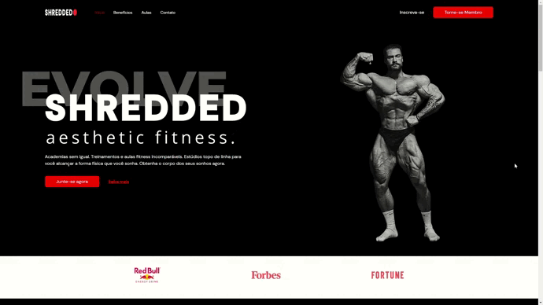

 

# About the project
This is a gym brand website built with React and TypeScript. The website provides information about gym services, different classes, and membership plans.
It is designed to be user-friendly and easy to navigate, with a modern and responsive design. Deployed with Cloudflare Pages.

👉 Live Demo: <a href='https://1e1ab570.shredded.pages.dev/'>Shredded🔴</a>

## Technologies

- [TypeScript](https://www.typescriptlang.org/)
- [React](https://reactjs.org/)
- HTML
- [Tailwind](https://tailwindcss.com/)

## Features

- Responsive design that works well on both desktop and mobile devices.
- Working form submit allowing user to send messages.
- Easy-to-use navigation menu and footer.

## Quick Demo 📸

 

